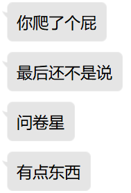
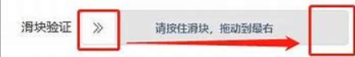
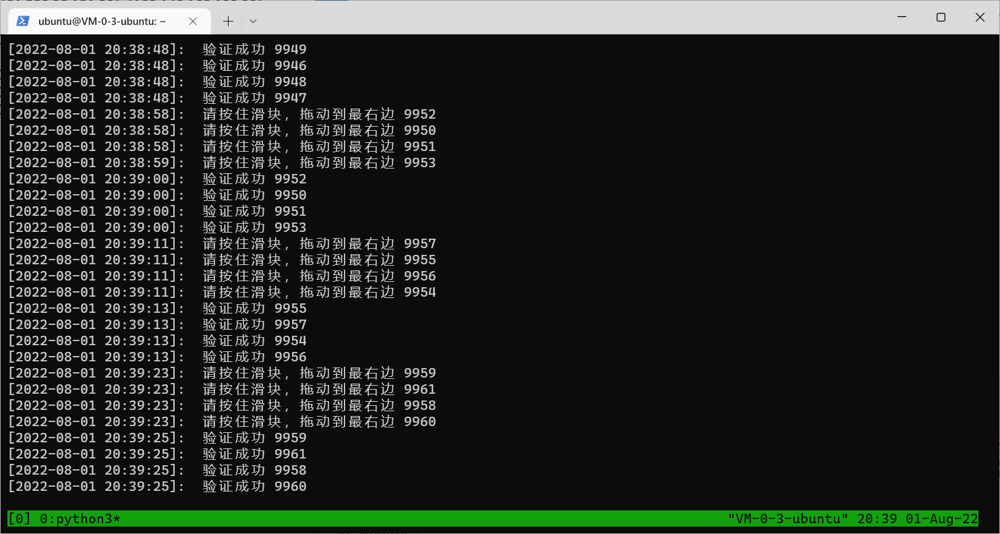
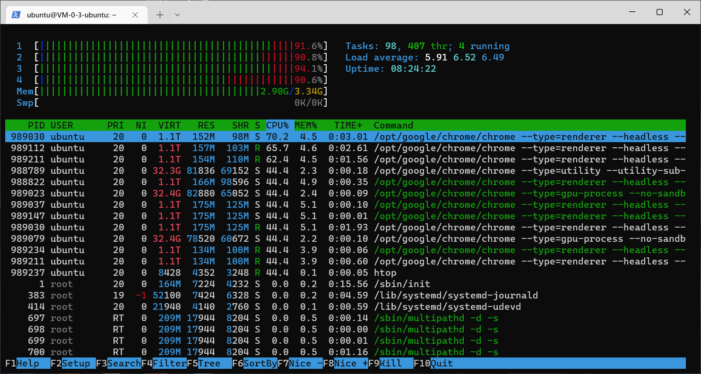
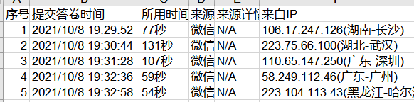
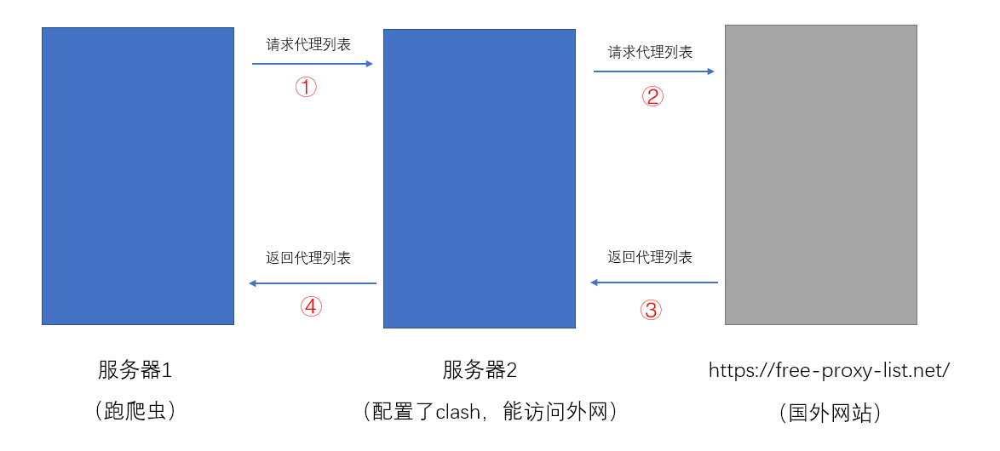
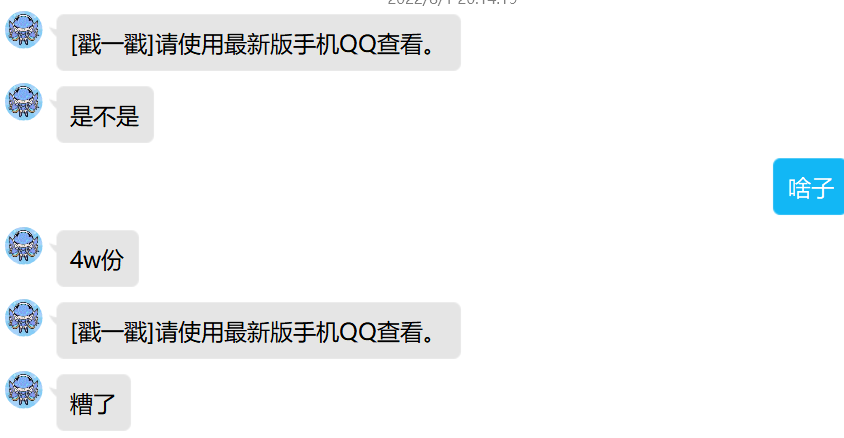
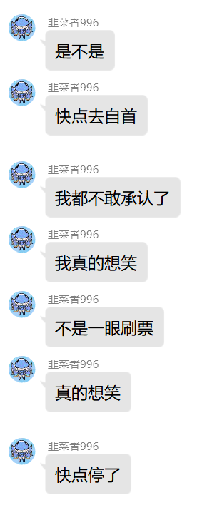
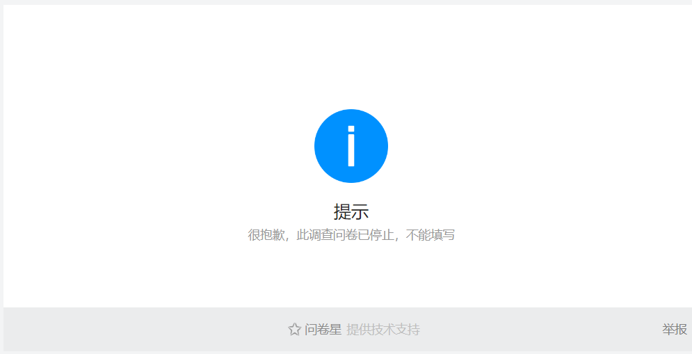

## python自动化程序填写问卷星


>暑假到来，收到某高中同学的邀请，填写问卷星问卷。作为好朋友，仅仅简单的填写自己的一份问卷肯定是远远不够的，我决定好好“帮”一“帮”他。


### 1. 前言

之前曾尝试过爬取问卷星，采取找接口后post表单的方式，无奈表单项实在太多并且问卷星方面也采取了代码混淆等反爬措施，再加上薄弱的js功底，遂放弃，竟还遭到某同学的嘲讽。。。





~~为了证明自己的食力~~ 一气之下，决定给这位同学亿点点教训，送他个十万份问卷，为报告的书写提供丰富的“数据支撑”。

当然，吸取了上次的教训，这次我决定采用更为简单方便的selenium模块，使用Google浏览器驱动模拟填写问卷。


### 2. 实现思路

#### 2.1 前期准备

使用Edge浏览器插件极速二维码，解析出问卷地址：https://www.wjx.cn/vm/tuhQw9L.aspx


打开问卷链接，可以看到共有18道题目，包括三种题型：单选、多选和简答。

为了使代码更加简洁，先预处理两个数组：选择题选项数量和是否多选

```python
# 每个问题选项的数量（-1表示该题为简答题）
option_nums = [2, 4, 6, 2, -1, 3, 2, 3, 3, -1, 2, 2, 2, 2, 3, -1, 3, -1]  # 18
# 0表示单选，1表示多选
multiple_choice = [0, 0, 0, 0, 0, 1, 1, 0, 0, 0, 0, 0, 0, 0, 0, 0, 0, 0]
```


对于填写问卷的策略，~~为方便好朋友后期报告的书写~~，选择题随机选项，简答题自己先编一组答案列表，到时候随机抽取即可。

```python
# q16表示第十六个问题自己编的答案
q16 = ['统一传递信息的平台',
       '目前平台太分散了，可以统一一下',
       '重要消息短信通知，与联网的消息区分开',
       '打电话通知消息',
       '尽量在一个平台上发布消息，一会看qq，一会看微信很麻烦',
       '传电报',
       '二进制01序列传输信息',
       '不知道',
       '无']
```


然后是随机选项的算法，我们之前已经预处理过选项的个数(num)，对于单选题，直接使用random模块的randint函数即可，封装成函数如下：

```python
# 返回区间[1,num]的随机整数
def random_option(num: int):
    x = random.randint(1, num)
    return x
```

对于多选题，情况稍微复杂一点。首先确定选几个，采用randint即可。

假设一个更加具体的情况，该题有五个选项，随机出来要选3个选项。我们先创建列表 [1,2,3,4,5] 要从中选三个出来,最简单的想法就是随机三个下标出来，然后装入新的列表；确实能做到随机，但这样的算法的复杂度是不稳定的，随机出来的下标可能重复，这就要重新再随机下标；尤其当选项较多时，例如5个选5个，最后一次想要选到正确的成功率仅1/5，算法的效率很低。

于是换个角度，先打乱列表，再取前3位的值。如何打乱呢：从列表最后一位开始（例子中下标pos=4），随机[0,4]的一个整数，将最后一位与该数下标对应的列表中的数交换，并将pos前移，直到pos移到下标为0的位置。代码如下：

```python
# num为该题选项数，返回一个选项列表
def random_multi_select(num: int):
    # 多选的数量
    length = random_option(num)
    pre = []
    # 顺序排序
    for i in range(1, num+1):
        pre.append(i)

    # 洗牌算法
    index = num - 1  # 从数组的最后一个数（下标为i）开始
    while index > 0:
        index_2 = random.randint(0, index)
        # 将得到的下标对应的元素和最后一个数交换
        pre[index], pre[index_2] = pre[index_2], pre[index]
        # 将最后一个数拿出数组
        index -= 1
    return pre[0:length]
```

简答题随机答案的思路类似，这里不再赘述。


#### 2.2 开爬！

```python
# 打开问卷星网址
driver = webdriver.Chrome(options=chrome_options)
driver.get('https://www.wjx.cn/vm/tuhQw9L.aspx')
```

如果不开启浏览器无头模式的话，程序会打开一个新窗口的浏览器。selenium模块最大的好处就是所见即所得，浏览器已经帮忙把复杂的js代码都加载好了；我们要做的就是f12打开开发者工具，找到页面中对应的元素，拷贝路径，最后对找到的元素进行点击、输入文本、拖拽等操作即可。

```python
q_num = len(option_nums)
for i in range(0, q_num):
    # 第i+1题目的选项数
    num = option_nums[i]
    if num == -1:
        # 简答题
        text_input = driver.find_element(By.XPATH, f'//*[@id="div{i+1}"]/div[1]/div/label/span')
        text_input.clear()
        text = short_answer.get_short_answer(i+1)
        text_input.send_keys(text)

    elif multiple_choice[i] == 0:
        # 单选题
        q_option = fun.random_option(num)
        q_select = driver.find_element(By.XPATH, f'//*[@id="div{i+1}"]/div[2]/div[{q_option}]')
        q_select.click()
    else:
        # 多选题
        q_selects = fun.random_multi_select(num)
        for j in q_selects:
            q_select = driver.find_element(By.XPATH, f'//*[@id="div{i+1}"]/div[2]/div[{j}]')
            q_select.click()
```

经过前期准备，这里短短20行代码就完成了对问卷的填写，并且运行起来填写的速度相当的快。

最后找到提交按钮，提交搞定！

```python
submit_button = driver.find_element(By.XPATH, '//*[@id="ctlNext"]')
submit_button.click()
```


**就这？**外面套个for循环不就可以无限提交了

几分钟后：emmm... 还是**太年轻了**！

填了十几二十份后，出现了智能验证：


无非是一种反爬手段，通过简单配置属性即可绕过：

```python
# 滑块防止检测
chrome_options.add_argument("--disable-blink-features=AutomationControlled")
chrome_options.add_experimental_option('excludeSwitches', ['enable-automation'])

# 将webdriver属性置为undefined
driver.execute_cdp_cmd('Page.addScriptToEvaluateOnNewDocument',
	{'source': 'Object.defineProperty(navigator, "webdriver", {get: () => undefined})'
})
```

好了，点击智能验证，验证成功

```python
time.sleep(0.2)
confirm = driver.find_element(By.XPATH, '//*[@id="alert_box"]/div[2]/div[2]/button')
confirm.click()
validation = driver.find_element(By.XPATH, '//*[@id="rectMask"]')
validation.click()
```

注意，在提交后程序最好睡个0.2秒，否则运行太快确认框还未弹出时就开始driver.find_element，会抛出异常。

本以为已面面俱到，没想到又提交了几十份问卷后又遇到了新问题：滑块验证。



网上搜了一圈关于selenium处理滑块的问题，全是用什么动作链，加速度，计算宽度计算距离啥的，硬是带我回忆了一遍高一上的
$$
x = v_0t + \frac 1 2 a t^2 a \qquad v = v_0 + at
$$
然后每0.1秒移动一段距离，最后拖过去。理论上是可行的，但代码运行起来每次都是拖到一半就滑回去了，搞了好一阵改了参数啥的都没用，血压飙升。后来转念一想，selenium这么牛逼，难道没有拖拽的方法吗？好在运气不错，drag这个单词也正好认识，被我 . 出来了。就短短两三行代码就实现了滑块验证：

```python
# 滑块验证
try:
    slider = driver.find_element(By.XPATH, '//*[@id="nc_1__scale_text"]/span')
    if str(slider.text).startswith("请按住滑块"):
        width = slider.size.get('width')
        ActionChains(driver).drag_and_drop_by_offset(slider, width, 0).perform()
except selenium.common.exceptions.NoSuchElementException:
    pass
```

因为并不是每次都要滑块验证的，所以try-except抱一下，以防抛异常。

至此，已经基本实现自动化填写问卷！


#### 2.3 部署到服务器

如果代码仅在本地跑不仅无法保证持续进行，断电断网都会中断程序；并且长时间的运行对电脑硬件影响也不小，部署到云服务器上就没这些问题。使用pycharm可以将代码轻松上传至服务器

>Tools -> Deployment -> Configuration  然后配置服务器，路径映射等

接着在浏览器上安装chrome和chromedriver，注意版本要一致

服务器上的chromedriver只能以无头方式启动

```python
# 设置无头浏览器
chrome_options.add_argument('--no-sandbox')
chrome_options.add_argument('--disable-dev-shm-usage')
chrome_options.add_argument('--headless')
chrome_options.add_argument('--disable-gpu')
```

记得再改一下driver_path,服务器的driver如果装到/bin目录下的话无需设置

ubuntu默认装有python3.8，selenium等包可以通过pip3或者pycharm右下角的python interpreter进行管理

选择服务器环境，pycharm中右键，运行，成功！

要实现服务器上的后台运行，即关闭终端后继续执行程序，在tmux中执行即可。

#### 2.4 一些优化

##### 2.4.1 多线程

为了增加问卷填写效率并充分利用服务器资源，可使用多线程。用solve()函数将一次爬取的过程包起来，并再main函数中写入：

```python
if __name__ == '__main__':
    pool = ThreadPoolExecutor(max_workers=4)
    for i in range(1000000):
        pool.submit(solve, i+1)
```

其中 $i+1$ 为solve函数参数，计数用; max_workers为最大并行数量

需要注意的是，driver一定记得及时关闭，否则内存中driver越堆越多会死机的。

开启多线程后，填写效率明显提升了，并且服务器资源也得到“充分利用”





##### 2.5.2 更改浏览器定位

使用过问卷星的兄弟们都知道，问卷发起者收集到的数据是带填写者的ip和位置的



定位看样子可能根据ip来的，更改浏览器的定位有可能没用，这样的话可以跳过这一步，不过也就几行代码，并且写我们学校微服务健康打卡脚本的时候有用，可以更改浏览器的定位，代码如下：

```python
# 设置浏览器定位
(longitude, latitude) = fun.random_position()
# print(longitude, latitude)
driver.execute_cdp_cmd("Emulation.setGeolocationOverride", {
    "latitude": latitude,
    "longitude": longitude,
    "accuracy": 100
})
```

其中 ```(longitude, latitude)``` 为经纬度，为了更加简便，我将每个城市的经纬度记录到字典里，每次随机取一个就行。若要追求完美，可以随机出一个经纬度坐标，具体情况可以根据对问卷填写的需求进行改变。


##### 2.5.3 使用代理

在问卷星收集的后台数据中，可以看到有一项是ip地址，后面具体的定位或许就是根据这个ip来的，而对于一台电脑来说ip是固定的，自然这样填写的数据稍显“不真实”。可以使用代理模拟随机的ip。

```python
# 设置代理
PROXY = proxy_util.random_proxy(proxy_list)  # 随机用一个代理
webdriver.DesiredCapabilities.CHROME['proxy'] = {
    "httpProxy": PROXY,
    "ftpProxy": PROXY,
    "sslProxy": PROXY,
    "proxyType": "MANUAL",
}
```

其中  ```random_proxy()``` 为自己写的一个方法，返回代理ip和端口号的字符串，如：```66.29.154.103:3128``` 

至于这些代理是哪里来的，直接网上搜索免费代理就可以搜到很多，不过国内很多是无法使用的，为了更加稳定，使用了国外的一个网站

[Free Proxy List - Just Checked Proxy List (free-proxy-list.net)](https://free-proxy-list.net/)

这个网站是实时更新的，数量也完全够用，唯一的缺点是需要翻墙。由于最后要部署到服务器上，所以需要让服务器能够翻墙，我是用的是clash，配置一下订阅链接就行了。遇到最大的坑就是要下载**Release**版的，下载链接如下：

[Release Premium 2022.07.07 · Dreamacro/clash (github.com)](https://github.com/Dreamacro/clash/releases/tag/premium)

为了不影响服务器的网络环境，使用了另一台服务器配置clash，并用django搭建了一个接口。这样主服务器就不需要配置clash了



从国外网站爬取代理列表用requests和正则解析就可以实现

```python
reg = re.compile('\d+.\d+.\d+.\d+:\d+')
proxies={
    'http': 'http://127.0.0.1:7890',
    'https': 'http://127.0.0.1:7890'
}
url = 'https://free-proxy-list.net/'
resp = requests.get(url, proxies=proxies)
# print(resp.text)
res = reg.finditer(resp.text)

ip_port_list = []
cnt = 0
for it in res:
    ip_port_list.append(it.group())
    cnt += 1
    if cnt >= length+1:
        break

return ip_port_list
```

由于排在后面的代理端口可能是很久没更新的，我用了length控制返回列表的长度。

这样在服务器1上访问服务器2上的接口就可以获取到代理列表了

```python
head = '(time.strftime("%Y-%m-%d %H:%M:%S", time.localtime()))'
def update_proxy():
    url = 'http://120.48.78.248:8000/proxy'
    param = {
        "key": "junbo",
        "num": "40"
    }
    resp = requests.get(url=url, params=param)
    proxy_list = list(resp.json())

    print('[' + eval(head) + f']: 更新代理列表,最近更新时间:', proxy_list[0], ' UTC')
    proxy_list.pop(0)
    return proxy_list
```

服务器2中正则解析时把更新时间一并解析进来了，可方便服务器1日志的输出。

最后只需要在main函数里定时更新一下代理列表就可以了，具体代码见后面完整代码，这里不再赘述。


### 3. 改进方向

- 问卷星后台位置的判定是根据IP地址判断的，而本次采取的代理IP大多是国外的，使得数据有”些许“不真实，可以在中间服务器爬取代理过程中从多个收集代理的网站爬取，并可以根据IP定位进行分类，根据问卷需求返回大陆或非大陆或指定地区的IP。
- 本次问卷填写的策略也是随机，对真正的收集数据是没有任何帮助的。尤其是简答题部分，后期可以考虑使用人工智能训练出的模型进行答题，可模拟出更加真实和丰富的问卷。甚至可以尝试使得问卷的回答具有逻辑性，当然工作量很大。
- 代码的耦合性还是很高，可以尝试在打开问卷后，根据页面分析题目个数，选项个数和题目类型等，使得代码更具有通用性。


### 4. 后记

经过了腾讯云4核G服务器一天两夜的高强度运作，该同学终于发现了，前来“感激”我。






当我再去服务器查看战况时发现程序一直在抛异常，再次打开问卷网址，结果。。



那就这样吧，4w份数据写个调查报告应该绰绰有余吧。


### 5. 完整代码
完整代码已上传GitHub，有帮助的话请点个star :smile:

[Junbo-Jabari/wjx: Fill out the questionnaire with python module selenium (github.com)](https://github.com/Junbo-Jabari/wjx)
